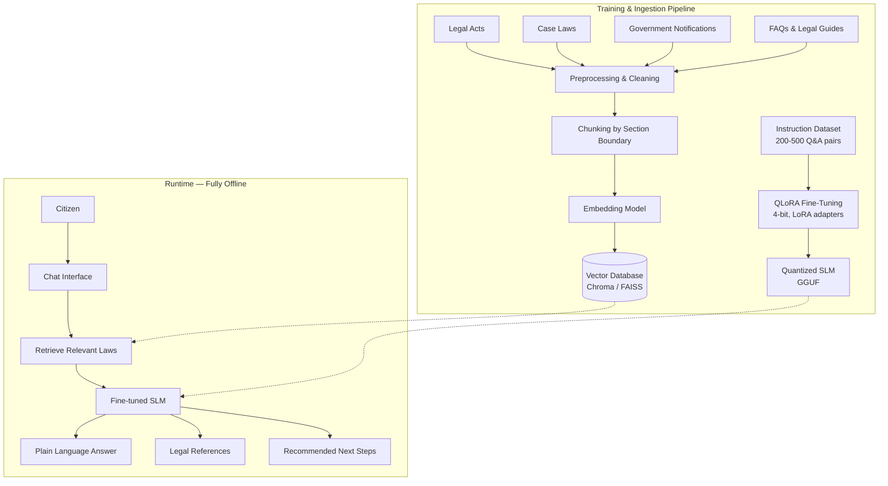

# ⚖️ AI Legal Assistance Platform — Domain-Specific SLM

> A fully offline, citizen-facing legal assistance platform powered by a fine-tuned Small Language Model (SLM) and local Retrieval-Augmented Generation (RAG).

**Team:** MR DEFENDERS
**Members:** Rohith M · Saran V · Puzhal Mani S · Sanjay Rathinam Marimuthu Nithya
**Hackathon Track:** AI Development — Legal Assistance using Domain-Specific SLMs

---

## 📌 Overview

Millions of citizens face legal problems — a defective product, a stalled FIR, a marriage registration, a dowry complaint — with no easy way to understand their rights or the exact steps to take. Lawyers are expensive and often inaccessible, especially in low-connectivity, rural, or under-served areas.

This project is a **standalone, self-contained legal guidance platform** that runs entirely on local hardware. It combines a curated legal corpus with a fine-tuned local SLM to answer citizen legal questions in plain language, complete with **cited sources**, a **confidence score**, and a **step-by-step procedural checklist** — without ever sending a single query to an external API.

## 🎯 Problem Statement

> "AI Development — Legal Assistance using Domain-Specific SLMs"

Build a domain-specific SLM-powered system that can answer legal questions and guide citizens through real procedures, grounded in actual statutory text rather than model guesswork.

## ✅ Supported Legal Domains

| Domain | Coverage |
|---|---|
| **Consumer Complaints** | Consumer Protection Act, 2019 — defective goods, deficient services, e-commerce complaints, filing with District Consumer Forum / National Consumer Helpline |
| **Criminal Procedure Basics** | FIR filing process, Zero FIR, remedies if police refuse to register a complaint, bailable vs. non-bailable offences, anticipatory bail (background only) |
| **Family Law Basics** | Marriage registration (Hindu Marriage Act / Special Marriage Act), Dowry Prohibition Act, 1961 and related penal provisions |

## ✨ Key Features

- 💬 **Natural-language query intake** (text, with optional speech-to-text)
- 🧭 **Automatic domain classification** — routes each query to the right legal index or flags it as out of scope
- 📚 **Retrieval-Augmented Generation** — retrieves top-k relevant statutory passages before generating any answer
- 📝 **Grounded, cited answers** — every substantive claim is backed by an Act and Section actually present in the retrieved corpus (zero-hallucination guardrail)
- ✅ **Step-by-step procedural checklists** — required documents, responsible authority, timeline, and fees
- 🎚️ **Confidence indicator** — low-confidence answers recommend professional consultation instead of guessing
- 🚨 **Safety escalation** — high-risk queries (domestic violence, active arrest, active court case) are prioritized to helpline/professional guidance over generated content
- 🔒 **Fully offline & private** — no query ever leaves the local machine; nothing is logged unless the user opts in
- ⚠️ **Persistent disclaimer** — the system never presents itself as a substitute for a licensed legal professional

## 🏗️ System Architecture

The system runs as two decoupled pipelines — an offline **Training/Ingestion** pipeline that prepares the corpus and model, and a **Runtime/Inference** pipeline that serves citizen queries — both executing entirely on local hardware with no external network calls.



### Pipeline Phases

1. **Ingestion & Vector Indexing** — Public statutory documents (Consumer Protection Act, BNSS, Dowry Prohibition Act, etc.) are parsed and chunked along section boundaries, tagged with domain/act/section metadata, embedded, and persisted into a local vector store (ChromaDB / FAISS).
2. **Model Fine-Tuning** — A curated instruction dataset (200–500 instruction–context–response triples grounded in statutory text) is used to fine-tune an open-weight 4B–7B SLM via QLoRA, then export + quantize it to GGUF for local inference.
3. **Real-Time Query Processing** — Incoming queries pass through a safety/crisis check first (bypassing generation for high-risk cases), then domain classification routes them to the right retrieval index.
4. **RAG Generation & Post-Processing** — The top-k relevant chunks are retrieved, the fine-tuned SLM generates a response strictly conditioned on that context, and the output is rendered with citations, a confidence score, a procedural checklist, and the mandatory disclaimer.

## 🧰 Tech Stack

| Layer | Technology |
|---|---|
| Local SLM | Open-weight 4B–7B model (e.g. Phi-3.5-mini, Qwen3-4B, Gemma-2-2B) |
| Fine-Tuning | QLoRA — 4-bit quantization, LoRA adapters |
| Model Export | GGUF (for efficient local inference) |
| Vector Store | ChromaDB / FAISS |
| Embeddings | Local embedding model (no external API calls) |
| Interface | Web-based chat UI |
| Speech-to-Text | Local STT engine (optional) |
| Runtime Hardware | CUDA-capable GPU, 6GB VRAM class (e.g. RTX 4050) |
| OS Support | Windows 11 / Linux |

## 🔐 Privacy & Security

- No calls to third-party hosted LLM APIs (OpenAI, Anthropic, Google, etc.) — **all inference is local**
- No query content is transmitted to any external server at runtime
- User queries are **not persisted** beyond the active session unless the user explicitly opts in to logging
- The system is fully functional **offline** after initial model and corpus setup

## 📂 Data Schema

**Legal Corpus:** `domain` · `act_name` · `section_number` · `section_text` · `jurisdiction` · `source_url`

**Fine-Tuning Dataset:** `instruction` · `context` · `response` · `cited_sections`

**Vector Store:** `embedding_id` · `chunk_text` · `metadata (domain, act_name, section_number)`

## 🚀 Getting Started

> ⚙️ Setup instructions are being finalized as the pipeline is built out — this section will be updated with exact install and run steps.

**Prerequisites**
- CUDA-capable GPU (6GB+ VRAM recommended)
- Python 3.10+
- Windows 11 or Linux

```bash
# Clone the repository
git clone <repo-url>
cd <repo-folder>

# Install dependencies
pip install -r requirements.txt

# Build the vector store from the legal corpus
python ingest.py

# Run the fine-tuned SLM locally + launch the chat interface
python app.py
```

## ⚠️ Disclaimer

This platform provides general legal information and procedural guidance only. It is **not a substitute for advice from a licensed legal professional**. For case-specific action, active court matters, arrests in progress, or situations involving domestic violence or immediate personal risk, please consult a qualified lawyer or contact the appropriate helpline immediately.

## 👥 Team — MR DEFENDERS

- Rohith M (Team Leader)
- Saran V
- Puzhal Mani S
- Sanjay Rathinam Marimuthu Nithya
